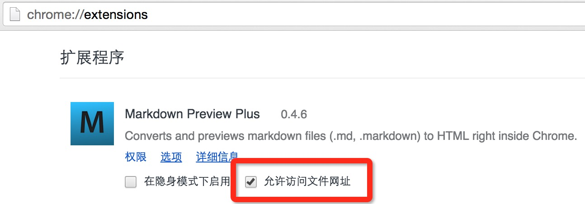

----

在chrome extension中有一个MarkDown Preview Plus的插件

可以用来预览本地的markdown文件

使用之前要允许该插件访问本地文件:

    

在浏览器中输入markdown文件的地址即可,如:

        file:///Users/lcl/Workshop/blog/livdipe.github.com.git/%E4%BD%BF%E7%94%A8MarkDown%20Preview%20Plus.md
